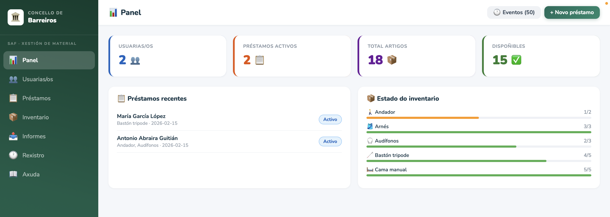
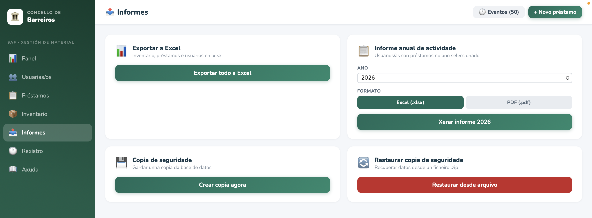

# SAF - Aplicación de Xestión de Préstamos

> **Nota importante**: Esta é unha aplicación de concepto/demostración e **non está afiliada nin ten relación oficial co Concello de Barreiros**. Trátase dun proxecto de mostra dunha aplicación que podería ser utilizada por un Servizo de Axuda ao Fogar (SAF) para xestionar préstamos de material.

## Que é este proxecto?

Este repositorio contén unha aplicación de escritorio para xestionar préstamos de material, deseñada como concepto para un Servizo de Axuda ao Fogar. A aplicación permite:

- Xestión de usuarios e usuarias
- Inventario de artigos prestables
- Rexistro de préstamos e devolucións
- Exportación de informes a Excel e PDF
- Sistema de copias de seguridade
- Interface completamente en galego

## Tecnoloxías

- **Tauri 1.5** - Framework de aplicacións de escritorio
- **Rust** - Backend e lóxica de negocio
- **React 19** - Interface de usuario
- **SQLite** - Base de datos embebida

## Capturas de Pantalla

### Panel Principal
Vista xeral do sistema con estatísticas, préstamos recentes e estado do inventario.



### Xestión de Usuarias/os
Lista de usuarios con busca e detalles completos, incluíndo préstamos activos.


### Creación de Préstamos
Modal intuitivo para seleccionar artigos e crear novos préstamos.


### Lista de Préstamos
Vista completa de todos os préstamos con filtros por estado e opcións de devolución.


### Inventario
Xestión de artigos con control de stock en tempo real por categorías.


### Informes e Exportación
Xeración de informes anuais, exportación a Excel e sistema de copias de seguridade.



## Estrutura do Repositorio

```
saf-tauri-app/
├── src/                    # Interface de usuario (React)
├── src-tauri/              # Backend (Rust)
│   ├── src/
│   │   ├── main.rs         # Punto de entrada
│   │   ├── database.rs     # Operacións de base de datos
│   │   ├── commands.rs     # API de comandos
│   │   ├── backup.rs       # Sistema de backups
│   │   └── excel.rs        # Exportación a Excel/PDF
│   ├── Cargo.toml          # Dependencias Rust
│   └── tauri.conf.json     # Configuración Tauri
├── MANUAL_ADMINISTRACION.md    # Manual para administradores
├── MANUAL_DESENVOLVEMENTO.md   # Manual para desenvolvedores
└── package.json            # Dependencias Node.js
```

## Documentación

Este repositorio inclúe dous manuais detallados en galego:

### Para Administradores

📄 **[MANUAL_ADMINISTRACION.md](./MANUAL_ADMINISTRACION.md)**

- Instalación da aplicación
- Xestión da base de datos SQLite
- Sistema de copias de seguridade (manuais e automáticas)
- Resolución de problemas comúns
- Mantemento recomendado

### Para Desenvolvedores

📄 **[MANUAL_DESENVOLVEMENTO.md](./MANUAL_DESENVOLVEMENTO.md)**

- Configuración do entorno de desenvolvemento (Windows, Linux, macOS)
- Compilación desde o código fonte
- Estructura do proxecto
- Como usar OpenCode con modelos avanzados (GLM-5, Claude, Kimi K2.5) para modificar a aplicación
- Probas e distribución

## Compilación Rápida

```bash
# Instalar dependencias
npm install

# Executar en modo desenvolvemento
npm run tauri-dev

# Compilar para produción
npm run tauri-build
```

## Licenza

Este proxecto está licenciado baixo a **Licenza Pública Europea da Unión Europea (EUPL v1.2)**.

A EUPL é unha licenza de software libre aprobada pola Comisión Europea, compatible con GPL e outras licenzas de código aberto. Permite o uso, modificación e distribución do código, sempre mantendo a mesma licenza nas obras derivadas.

Máis información: [https://joinup.ec.europa.eu/collection/eupl/eupl-text-eupl-12](https://joinup.ec.europa.eu/collection/eupl/eupl-text-eupl-12)

---

*Aplicación de concepto - Non afiliada co Concello de Barreiros*